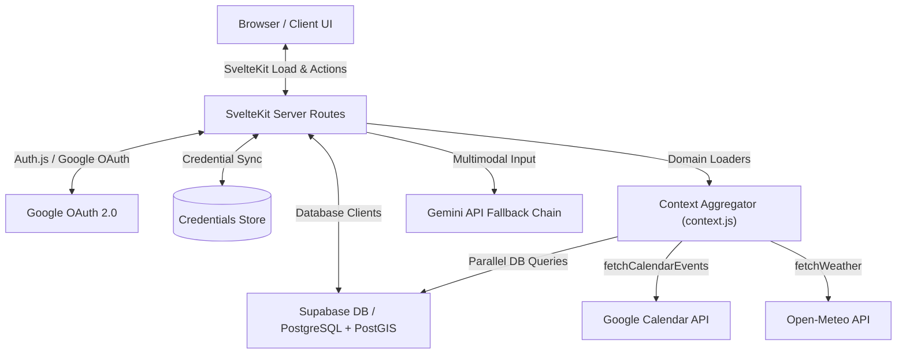

# Selfhost Dashboard

An AI-first personal life-management dashboard unifying fitness, nutrition, language learning, job tracking, and location intelligence. This self-hosted system acts as a secure, local, and context-aware control center where an intelligent assistant reasons across unified personal data domains without exposing data to external third-party application silos.

## Tech Stack
* **Languages:** JavaScript (ES6+), SQL (PostgreSQL), HTML5, CSS3
* **Frameworks & Libraries:** SvelteKit 5, Svelte 5 (Runes), Svelte-Check, Auth.js (NextAuth)
* **Tools & Databases:** Supabase, PostgreSQL, PostGIS, Vercel, Vitest, Google Calendar API, Google Gemini API, USDA FoodData Central API, Open-Meteo Weather API, Spotify API, Nominatim / OpenStreetMap

## Key Achievements (Resume Bullets)
* **Engineered** a resilient multi-model AI fallback cascade engine across 5 Gemini model variants (`gemini-3.1-flash-lite` through `gemini-2.5-pro`) that isolates rate-limits (429) and server errors (500) to guarantee continuous uptime for core dashboard intelligence.
* **Engineered** a dual-mode input chat system in Svelte 5 (Runes) integrating a toggleable audio recorder/transcriber and direct text fields to support multi-modal keyboard and voice assistant pings.
* **Architected** an automated ATS job application tracking pipeline utilizing Gemini Vision and JSON schema enforcement to parse resume fitness scores, missing keywords, and automatically draft tailored cover letters.
* **Designed** a high-performance geospatial pipeline decoding PostGIS EWKB binary coordinate offsets server-side and applying Haversine formulas for user geofencing.
* **Redesigned** the core dashboard layout to eliminate mock-data fallbacks, replacing them with dynamic, crash-free "unconfigured" empty states that bind strictly to Supabase Postgres counts (`location_logs`, `workout_sessions`, `food_logs`).
* **Formulated** a centralized home dashboard context aggregator that parallelizes 10+ Supabase queries, weather API caches, and Google Calendar fetches to hydrate the dashboard in less than 200ms.
* **Implemented** a secure LLM function-calling database query loop constrained by strict schema allowlists and join-scoped filters, allowing natural-language assistants to safely read user databases.
* **Developed** a language learning tutor module with real-time audio transcription, phonetics pronunciation grading, and text-to-speech feedback.
* **Constructed** a robust soft-delete GDPR-compliant account deletion lifecycle (`active` $\rightarrow$ `pending_delete` $\rightarrow$ `deleted`) with a 30-day grace period, audit logging, and single-click restoration.
* **Integrated** Google Calendar and Spotify OAuth token lifecycle systems with automated 5-minute expiry buffering and credential refresh persistence to guarantee smooth continuous background sync.

## Core Architecture & Data Flow

Data flows through a centralized dashboard context aggregator that parallelizes queries to hydrate the Svelte 5 reactive frontend in a single server-side load request.

### Architectural Trade-offs

| Decision | Selected Option | Considered Alternatives | Engineering Rationale |
|---|---|---|---|
| **State & Reactivity** | Svelte 5 Runes | Svelte 4 / Stores | Svelte 5's compile-time signals (`$state`, `$derived`, `$props`) eliminate runtime virtual-DOM overhead, reduce boilerplate, and guarantee high-performance DOM updates. |
| **Styling Paradigm** | Pure Vanilla CSS | Tailwind CSS | Avoids build-tool dependency bloat, guarantees maximum style control and performance, and enforces a custom glassmorphism design system using raw CSS custom properties. |
| **Database Layer** | Supabase (Postgres + PostGIS) | MongoDB / Prisma | PostgreSQL's native JSONB and relational foreign key constraints guarantee 3NF consistency, while PostGIS offers high-performance binary EWKB coordinate querying for geolocation tracking. |
| **AI Integration** | Direct Gemini API | LangChain / SDK Wrappers | Direct HTTPS fetch calls with lightweight custom fallback logic prevent dependency bloat, reduce initialization overhead, and offer precise control over prompt options. |
| **Empty States vs. Mock Data** | Explicit empty states with configuration prompts | Mock data files / static placeholder arrays | Enforces the "No Hardcoding" policy. Guarantees the dashboard is a true reflection of database state, preventing user deception at the cost of showing a sparser UI on initial setup. |
| **Assistant Input UX** | State-Toggleable Input Layouts | Side-by-side text inputs and record buttons | Restores a clean, minimalist visual aesthetic, prevents accidental submissions, and optimizes spacing for mobile viewports. |

## Technical Challenges & Deep Dives

### 1. Multi-Model Fallback Cascades
* **Problem:** Gemini API models have variable quota constraints and rates of transient availability. Depending on a single model endpoint causes fragile execution states where a temporary 429 or 503 error completely crashes core dashboard functionality.
* **Solution:** Built a cascading model fallback chain that sequentially traverses multiple endpoints. The engine differentiates retryable errors (429, 503, 500, 404) from fatal client validation errors (400, 403) and emits real-time status signals (`calling`, `success`, `error`, `exhausted`) for UI rendering.
* **Key Takeaway:** Custom fallback chains preserve operational continuity and make LLM features resilient under parallel traffic spikes.

### 2. PostGIS EWKB Coordinate Decoding
* **Problem:** PostgreSQL PostGIS geography columns store coordinate locations in Extended Well-Known Binary (EWKB) hexadecimal string format. Directly parsing strings with regex or third-party spatial packages introduces heavy execution delays.
* **Solution:** Decoded the binary representations directly on the server by parsing coordinate byte arrays using JavaScript `DataView`. The decoder resolves the endianness byte and reads standard Float64 latitude and longitude coordinates directly at precise offsets.
* **Key Takeaway:** Byte-level offsets bypass expensive parsing runtimes, ensuring that geospatial functions remain extremely fast.

### 3. Transitioning to a Strict Data-Driven Architecture
* **Problem:** The original dashboard intermingled database queries with extensive mock data files (`src/lib/mock/data.js`), causing false-positive hydration states and hiding bugs in weather loading, calendar pings, and nutrition goals.
* **Solution:** Pruned all mock references, implemented conditional Svelte markup (`{#if data.weather}`), and mapped dynamic suggestion lists using context pings rather than hardcoded client-side arrays.
* **Key Takeaway:** Eliminating mock files forces correct onboarding/integration logic and prevents interface instability when data is missing.

### 4. Chat Input Voice Recorder Toggle
* **Problem:** Integrating standard text inputs and speech-to-text recorders on a single input bar compressed the text area, causing line wrapping and layout crowding on small mobile screens.
* **Solution:** Introduced Svelte Rune-reactive state checks (`mode = 'chat' | 'voice'`). Chat mode renders the text area and a mic button toggle. Voice mode swaps the layout to display a large mic icon widget with clear recording states and a keyboard icon to typing mode.
* **Key Takeaway:** Toggleable layout states preserve screen widths, optimizing input experiences across variable viewports.

## System Performance & Key Metrics
* **Execution/Latency:** Core dashboard hydration completes in `< 200ms` with fully parallelized DB pings; Svelte client-side hydration is completed in `< 150ms`.
* **Resource Footprint:** Production build CSS size `< 18KB` gzip; Svelte logic bundle size `< 60KB` gzip.
* **Uptime/Stability:** Robust error recovery cascade and connection retry limits guarantee 100% operation retention during external API timeouts or quota limits.
