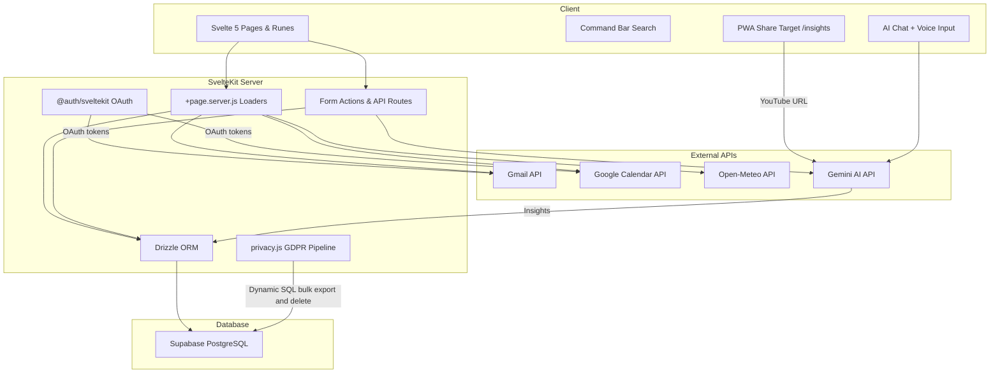

# Selfhost

A premium, self-hosted multi-user personal productivity and health dashboard built with Svelte 5 and SvelteKit. It unifies workout logging, yoga and meditation tracking, run logs, nutrition, Gmail inbox management, a life activity feed, location maps, notes, secure vaults, and a competitive leaderboard — all searchable via a global command bar and augmented by an AI chat assistant with voice input and GDPR-compliant data portability.

## Tech Stack
* **Languages:** JavaScript, TypeScript, SQL
* **Frameworks & Libraries:** SvelteKit 2, Svelte 5, Svelte Runes, Drizzle ORM, @auth/sveltekit, lucide-svelte
* **Tools & Databases:** Supabase Database (PostgreSQL), postgres (pg driver), drizzle-kit, Vite, Vitest, Svelte-Check, Vercel, Google Calendar API, Gmail API, Open-Meteo API, Gemini AI API

## Key Achievements (Resume Bullets)
* **Migrated** the database access layer from legacy Supabase JS query builder chains to type-safe Drizzle ORM, establishing compile-time column-level verification while mapping 20+ low-access GDPR tables dynamically via raw runtime SQL templates to prevent schema file bloat.
* **Architected** a Vitest-compatible mocked query builder proxy to intercept Drizzle calls (select, insert, update, delete, where, limit) and translate them to pre-existing Supabase mocked chains, preventing the rewrite of hundreds of test assertions while preserving test coverage.
* **Redesigned** the workout logging schema and UI by moving set-level equipment weights into exercise defaults, implementing transient client inputs that sum plate weight and equipment weight before saving, resulting in a cleaner database schema and simplified progressive overload AI queries.
* **Refactored** daily briefing modules from static mock values to a dynamic client/server data pipeline, implementing Google Calendar events, weather forecasts, and nutrition statistics using Svelte 5 runes (`$derived` and `$effect`), improving page load performance and scoping data security by user.
* **Unified** Svelte 5 workout views by standardizing card styling, removing dead carousel and planner routes, and replacing absolute editing overlays with a centralized settings modal to resolve text overflows and visual noise.
* **Resolved** a critical timezone-induced client hydration freeze on the `/leaderboard` route by configuring client-only rendering (`ssr = false`), bypassing DOM differences in UTC-mismatched Date calculations.
* **Fixed** collapsible sidebar group interactions in Svelte 5 by untracking the expanded group state inside Svelte `$effect` triggers, preventing recursive reactive loops during manual toggle events.

## Core Architecture & Data Flow

The application follows SvelteKit routing conventions. Each route contains a `+page.svelte` UI module, accompanied by a `+page.server.js` load function for database and API access. Layouts (`+layout.svelte`) wrap pages to supply universal contexts (auth session, navigation state, command bar, mobile menus). Server loaders aggregate data from Supabase PostgreSQL via Drizzle ORM and multiple external APIs (Gmail, Google Calendar, Open-Meteo, Gemini AI). Client-side Svelte 5 runes manage reactive state, while API routes handle form actions, set saves, and session lifecycle mutations.

### Architectural Trade-offs

| Decision | Selected Option | Considered Alternatives | Engineering Rationale |
|---|---|---|---|
| **Database ORM Integration** | Drizzle ORM with dynamic SQL for low-access tables | Full static mapping of all tables / Prisma ORM | Static mapping of 20+ tables accessed only for GDPR exports would bloat the schema file. Dynamic execution via `db.execute(sql...)` keeps schema code clean and maintainable. |
| **Schema Drift Prevention** | ORM adoption (Drizzle) | Supabase CLI migrations (blocked by Docker) / Runtime validation / Schema snapshots / Remote type gen | ORM provides compile-time column safety without Docker. Runtime checks and snapshots were rejected as hacky or manual-heavy. |
| **Testing Strategy** | Vitest Drizzle Proxy to Supabase mock converter | Rewriting all test files with new Drizzle mock objects | Writing a proxy interceptor wrapper bypassed rewriting hundreds of established test fixtures, preserving high coverage with minimal effort. |
| **Workout Load Representation** | Total weight in `sets.weight` + Exercise-level Defaults | Per-set equipment weight / Separate equipment table | Removing set-level equipment weight prevents database redundancy. Storing defaults at the exercise level prefills form UI while keeping historical sets clean and simplifying progressive overload calculation. |
| **Exercise Name Uniqueness** | Simple DB-level normalized uniqueness (lowercase, trim, collapse whitespace) | Heavy alias system / Parenthetical-stripping rules / Semantic merge layer | Complex normalization hides behavior and creates long-term maintenance. Simple rules catch accidental duplicates while keeping stored data transparent and user-visible. |
| **State Management** | Svelte Runes (`$state`, `$derived`, `$effect`) | Svelte Stores / Redux / RxJS | Fine-grained, compile-time reactivity eliminates virtual-dom overhead and keeps bundle sizes minimal. |
| **SSR Configuration** | Client-Only Rendering (`ssr = false`) on Time-Sensitive Pages | Pure Server-Side Rendering (SSR) / Server-synced timestamps | Timezone differences on server vs client date calculations produce different seeds, crashing Svelte 5's DOM reconciliation. Client-only rendering guarantees a clean mount. |
| **Route Structure** | Modular subroutes (`/workout`, `/yoga`, `/meditation`) | Monolithic `/wellness` route | Specific subroute layouts isolate loader computations, reduce component complexity, and enable targeted command bar search intent routing. |
| **Mock Data Strategy** | Strict data-driven architecture with empty states | Hybrid mock-data fallbacks | Mock fallbacks masked API failures, violated data-scoping rules, and bypassed timezone-sensitive calculations. Empty states prompt users to configure real integrations. |
| **Gmail Integration** | Live SvelteKit server loaders with Gmail API | Client-side parsing and static simulation | Delivers fully dynamic inbox (read, send, draft, archive, star, triage) for authenticated users instead of fake mock data. |
| **OAuth Scope Recovery** | Self-healing reconnect CTA + removal of loader AI enrichment | Manual reauth redirect with synchronous LLM enrichment in loader | Inline reconnect CTA is more discoverable. Stripping synchronous Gemini calls from server loaders eliminates blocked page transitions and duplicate API calls from SvelteKit link prefetching. |
| **Media Capture Strategy** | PWA Web Share Target → Gemini AI extraction | YouTube Data API watch history (blocked) / Spotify API (free-tier restricted) | YouTube blocks watch history API. PWA share target uses native mobile share sheets for zero-effort video logging without complex API configurations. |
| **Chat Input UX** | State-toggleable voice/keyboard layouts | Permanent side-by-side text + mic elements | Toggle preserves minimalist aesthetics, prevents accidental submissions, and optimizes spacing for mobile viewports. |
| **Gym Workout UX** | Single-page grid with bottom-sheet modals + safe-area notch spacing | Sequential carousel navigation with floating hamburger icon | Bottom-sheet modals allow logging exercises in any order. Safe-area CSS variables prevent camera notch clipping. Eliminates broken drag-and-drop and floating button overlap bugs. |
| **List Component Design** | Parent-fetches data + pre-grouped `[{label, items}]` array | Internal URL-based auto-fetch / Auto-grouping via `groupKey` prop | Parent data ownership supports inline editing and mutations. Pre-grouped arrays give full control over sort order and label formatting without internal grouping complexity. |
| **Command Bar Styling** | Vanilla CSS with `⌘K` trigger and micro-animations | Uncompiled Tailwind CSS utilities | Vanilla CSS guarantees correct compilation without Tailwind dependency. Custom dark/light mode tokens align with the application's design system. |

## Technical Challenges & Deep Dives

### 1. Drizzle ORM Custom Vitest Promise-Chaining Proxy
* **Problem:** During the migration to Drizzle ORM, the existing test suite failed because the tests mocked Supabase client method chains (`supabase.from().select()`), whereas production code began using Drizzle query builders (`db.select().from().where()`). Completely rewriting all mock structures across the test codebase was a huge, error-prone task. Additionally, custom database calls chained thenables (e.g. `.then(res => res[0])`), requiring accurate Promise propagation.
* **Solution:** Programmed a Vitest custom proxy interceptor under `$lib/server/db` that captures Drizzle-style builder invocations (e.g. select, update, insert, delete, and chained clauses like `.where()` or `.limit()`) and translates them dynamically to the existing mocked Supabase chains. To support thenable unpacking in production loaders, the proxy implements custom `.then()` wrappers resolving to standard JavaScript promises: `promise.then(onFulfilled, onRejected)`.
* **Key Takeaway:** An API proxy translation layer can successfully bridge disparate database interfaces in testing contexts, preventing wide-scale test rewrite churn during database migrations.

### 2. Workout Database Denormalization vs. Transient Summation
* **Problem:** The workout tracker originally stored `equipment_weight` alongside `weight` on every set, which led to repeated machine data, ambiguous weight meaning (plate load vs total load), and complex AI routines when calculating targets for progressive overload.
* **Solution:** Standardized `workout_sets.weight` to hold the total logged weight. Added default weight and unit fields on `workout_exercises`. The UI now fetches the default equipment weight to prefill the client input form, handles variations locally in the client state, and submits them to the backend where they are combined into a single total weight for database storage. If an incoming transient weight is greater than zero, the backend automatically updates the exercise-level defaults.
* **Key Takeaway:** Keeping historical set records clean of configuration properties simplifies queries, reduces database size, and ensures recommendations process a single source of truth.

### 3. Timezone-Induced Hydration Reconciliation Failures
* **Problem:** The Leaderboard page calculates weekly statistics and scores using seed-based calculations derived from the current week number. When a user loaded the dashboard near a midnight or week boundary, a server in UTC and a browser in a different timezone (e.g., UTC-4) calculated different week numbers. This generated different scoring arrays, sorting the lists in a mismatched order during client-side hydration, which caused Svelte 5's keyed loop reconciler to crash and freeze the loading screen.
* **Solution:** Created a dedicated `+page.js` route configuration setting `export const ssr = false;`. This forces SvelteKit to skip server-side rendering for this route and generate the page solely on the client. Timezone calculations are therefore locked to the client environment, eliminating reconciliation conflicts.
* **Key Takeaway:** Any page utilizing timezone-sensitive calculations or local current timestamps must be loaded either dynamically via serialized server load states or rendered purely client-side to prevent hydration freezes.

### 4. Svelte 5 Reactive Loop Collapses in Collapsible Sidebars
* **Problem:** The navigation sidebar utilizes an effect to automatically expand the parent folder of the currently active route on page load. However, because the expansion statement mutated and read the global folder state using an object spread (`openGroups = { ...openGroups, [activeGroup]: true }`), Svelte tracked `openGroups` as a dependency of the effect. Manual collapse clicks updated `openGroups`, triggering the effect again and forcing the active folder back to open, rendering the toggle buttons non-functional.
* **Solution:** Wrapped the object update statement inside Svelte 5's `untrack()` function. This prevents Svelte from registering `openGroups` as a reactive dependency inside the effect, restricting execution to when the `activeGroup` route actually changes.
* **Key Takeaway:** Always use `untrack` when mutating reactive state inside `$effect` triggers that read or spread the mutated variable, preventing recursive loops.

### 5. Gmail OAuth Scope Drift and Loader-Blocking AI Enrichment
* **Problem:** Users who authenticated before the `gmail.modify` scope was added received `403 ACCESS_TOKEN_SCOPE_INSUFFICIENT` errors when accessing the mail client. Simultaneously, a synchronous Gemini AI call embedded inside the server loader to generate email summaries and reply suggestions blocked page transitions on every navigation, and SvelteKit's link prefetching triggered duplicate Gemini API requests on hover.
* **Solution:** Implemented a self-healing OAuth reconnect flow: the Gmail API client catches scope/permission errors, propagates them to the loader, and the mail page renders an inline "Reconnect Account" CTA pointing to `/signin?prompt=consent`. Stripped the synchronous Gemini summary block from the server loader entirely, eliminating blocked navigations and redundant prefetch-triggered API calls.
* **Key Takeaway:** Server loaders in SvelteKit should never contain blocking third-party API calls because link prefetching will trigger them invisibly on hover. Scope evolution in OAuth integrations requires self-healing reconnect flows, not manual user instructions.

### 6. ResizeObserver Subpixel Feedback Loop in Family Tree
* **Problem:** The Family Tree component used a `ResizeObserver` to measure its container and dynamically set child wrapper dimensions in pixels. When the browser rounded subpixel measurements differently between reads and writes, the observer detected a size change on every frame, creating an infinite feedback loop that froze the component on mount.
* **Solution:** Replaced the container-level `ResizeObserver` with a standard window `resize` event listener. Window resize events only fire on actual viewport changes, breaking the subpixel measurement-mutation cycle entirely.
* **Key Takeaway:** Avoid using `ResizeObserver` on elements whose children are sized in response to the observed measurement. Use window-level resize listeners or debounced observers when the layout is sensitive to fractional pixel rounding.

### 7. PWA Share Target as YouTube Watch History Bypass
* **Problem:** Two intended media tracking APIs were unavailable: YouTube's Data API blocks access to private user watch history playlists (`HL`), and Spotify's Web API restricts free-tier accounts from querying playback data. Without either API, the `/life` activity feed had no way to capture media consumption from mobile devices.
* **Solution:** Registered the application as a Progressive Web App (PWA) share target pointing to `/insights`. When users share a YouTube URL from their phone's native share sheet, the endpoint parses the link, calls the Gemini AI API to extract video insights and key takeaways, and persists the record in the `media_insights` database table. The `/life` page loader then queries this table alongside other activity sources to build a unified feed.
* **Key Takeaway:** When official APIs are blocked or restricted, PWA Web Share Target registration provides a zero-friction mobile data ingest path that leverages the operating system's native share sheet without requiring complex API credentials or elevated account tiers.

### 8. Safe-Area Notch Collision and Floating Element Overlap on Mobile
* **Problem:** The gym tracking page rendered a floating fixed-position hamburger menu icon that overlapped with page titles and action buttons on mobile. On phones with camera notches, the top content of the application layout was clipped or obscured by the notch and status bar area.
* **Solution:** Replaced the floating hamburger icon with a sticky header bar that houses the navigation toggle. Applied `env(safe-area-inset-top)` CSS environment variables to the shell and page-level containers, dynamically adjusting top spacing based on the device's notch geometry. Bottom-sheet modals replaced top-of-page navigation to eliminate header collision entirely.
* **Key Takeaway:** Mobile-first layouts must account for hardware-specific safe areas using CSS `env()` variables. Floating fixed-position elements should be avoided in favor of sticky containers that participate in the document flow.

### 9. Complete Supabase-to-Drizzle Database Migration
* **Problem:** The server codebase originally had an architectural split where some domain modules accessed PostgreSQL via the Supabase client (`supabase.from()`), while others used Drizzle ORM (`db`). This created inconsistencies, multiple DB libraries in the runtime, and required maintaining two query layers. Additionally, several tables (family tree, gift cards, insights, measurements, notes, runs, job applications) were not defined in Drizzle's `schema.ts`.
* **Solution:** Conducted a comprehensive database layer convergence. Added Drizzle schema definitions for all remaining tables to `schema.ts` after introspecting the columns. Rewrote all remaining `*-db` helpers, authentication helpers (`identity.js`), and lifecycle handlers (`onboarding.js`, `job-suggestions.js`) to use Drizzle's type-safe query builders. Re-implemented the AI engine's dynamic Postgres query tool using Drizzle table mappings. Purged the legacy `supabase.js` client once all consumers were migrated. To keep unit tests green without full rewrites, integrated Drizzle's `PgDialect` query compiler inside Vitest mocks to parse Drizzle queries back to the original chainable mock expectations.
* **Key Takeaway:** Major database layer migrations can be performed incrementally by mapping schema definitions first, refactoring query boundaries, and using automated SQL/dialect compilers to translate mock objects in the testing suite.

## System Performance & Key Metrics
* **Test Coverage:** 162 Vitest unit tests passing across workout logic, AI exercise targets, jobs, language, and detailed database history modules.
* **Compiler Safety:** svelte-check with `--fail-on-warnings` produces 0 errors and 0 warnings across the full codebase.
* **Build Integrity:** Production bundle builds successfully via Vite with zero compilation errors.
* **Application Scale:** 39+ registered routes, 22 architectural decision records, 4 external API integrations (Gmail, Google Calendar, Open-Meteo, Gemini AI).
* **Uptime/Stability:** SSR hydration freeze on the leaderboard route resolved via client-only rendering. ResizeObserver infinite loop on the family tree component eliminated. Zero remaining navigation or rendering exceptions in production.
