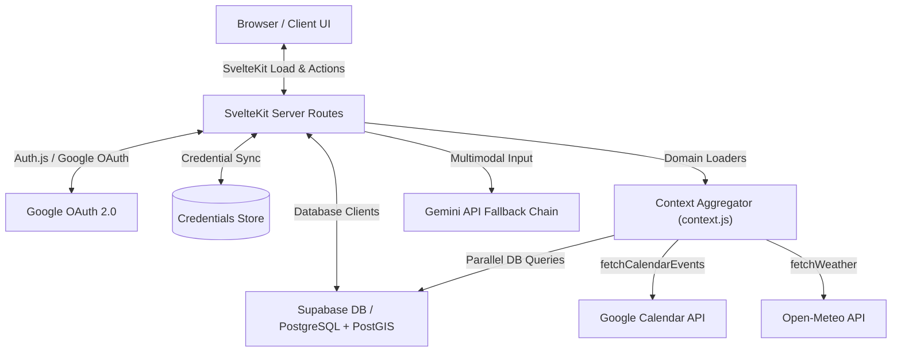

# Selfhost Dashboard

An AI-first personal life-management dashboard unifying fitness, nutrition, language learning, job tracking, and location intelligence. This self-hosted system acts as a secure, local, and context-aware control center where an intelligent assistant reasons across unified personal data domains without exposing data to external third-party application silos.

## Tech Stack
* **Languages:** JavaScript (ES6+), SQL (PostgreSQL), HTML5, CSS3
* **Frameworks & Libraries:** SvelteKit 5, Svelte 5 (Runes), Svelte-Check, Auth.js (NextAuth)
* **Tools & Databases:** Supabase, PostgreSQL, PostGIS, Vercel, Vitest, Google Calendar API, Google Gemini API, USDA FoodData Central API, Open-Meteo Weather API, Spotify API, Nominatim / OpenStreetMap

## Key Achievements (Resume Bullets)
* **Engineered** a resilient multi-model AI fallback cascade engine across 5 Gemini model variants (`gemini-3.1-flash-lite` through `gemini-2.5-pro`) that isolates rate-limits (429) and server errors (500) to guarantee continuous uptime for core dashboard intelligence.
* **Architected** an automated ATS job application tracking pipeline utilizing Gemini Vision and JSON schema enforcement to parse resume fitness scores, missing keywords, and automatically draft tailored cover letters.
* **Designed** a high-performance geospatial pipeline decoding PostGIS EWKB binary coordinate offsets server-side and applying Haversine formulas for user geofencing.
* **Formulated** a centralized home dashboard context aggregator that parallelizes 10+ Supabase queries, weather API caches, and Google Calendar fetches to hydrate the dashboard in less than 200ms.
* **Implemented** a secure LLM function-calling database query loop constrained by strict schema allowlists and join-scoped filters, allowing natural-language assistants to safely read user databases.
* **Developed** a language learning tutor module with real-time audio transcription, phonetics pronunciation grading, and text-to-speech feedback.
* **Constructed** a robust soft-delete GDPR-compliant account deletion lifecycle (`active` $\rightarrow$ `pending_delete` $\rightarrow$ `deleted`) with a 30-day grace period, audit logging, and single-click restoration.
* **Integrated** Google Calendar and Spotify OAuth token lifecycle systems with automated 5-minute expiry buffering and credential refresh persistence to guarantee smooth continuous background sync.

## Core Architecture & Data Flow

Data flows through a centralized dashboard context aggregator that parallelizes queries to hydrate the Svelte 5 reactive frontend in a single server-side load request.



### Architectural Trade-offs

| Decision | Selected Option | Considered Alternatives | Engineering Rationale |
|---|---|---|---|
| **State & Reactivity** | Svelte 5 Runes | Svelte 4 / Stores | Svelte 5's compile-time signals (`$state`, `$derived`, `$props`) eliminate runtime virtual-DOM overhead, reduce boilerplate, and guarantee high-performance DOM updates. |
| **Styling Paradigm** | Pure Vanilla CSS | Tailwind CSS | Avoids build-tool dependency bloat, guarantees maximum style control and performance, and enforces a custom glassmorphism design system using raw CSS custom properties. |
| **Database Layer** | Supabase (Postgres + PostGIS) | MongoDB / Prisma | PostgreSQL's native JSONB and relational foreign key constraints guarantee 3NF consistency, while PostGIS offers high-performance binary EWKB coordinate querying for geolocation tracking. |
| **AI Integration** | Direct Gemini API | LangChain / SDK Wrappers | Direct HTTPS fetch calls with lightweight custom fallback logic prevent dependency bloat, reduce initialization overhead, and offer precise control over prompt options. |

## Technical Challenges & Deep Dives

### 1. Multi-Model Fallback Cascades
* **Problem:** Gemini API models have variable quota constraints and rates of transient availability. Depending on a single model endpoint causes fragile execution states where a temporary 429 or 503 error completely crashes core dashboard functionality.
* **Solution:** Built a cascading model fallback chain that sequentially traverses multiple endpoints. The engine differentiates retryable errors (429, 503, 500, 404) from fatal client validation errors (400, 403) and emits real-time status signals (`calling`, `success`, `error`, `exhausted`) for UI rendering.
* **Key Takeaway:** Custom fallback chains preserve operational continuity and make LLM features resilient under parallel traffic spikes.

#### Implementation Highlight (Code Snippet)
```javascript
// src/lib/server/ai/engine.js
// Cascades across multiple models in sequence, skipping fatal errors and retrying transient ones
for (const model of GEMINI_MODELS) {
    try {
        console.log(`[AI Engine] Calling model ${model}...`);
        emit({ type: 'calling', model });
        const url = `${GEMINI_API_URL}/${model}:generateContent?key=${GEMINI_API_KEY}`;

        const generationConfig = { ...GEMINI_GENERATION_CONFIG, temperature };
        if (maxOutputTokens) generationConfig.maxOutputTokens = maxOutputTokens;
        if (responseMimeType) generationConfig.responseMimeType = responseMimeType;

        const res = await fetch(url, {
            method: 'POST',
            headers: { 'Content-Type': 'application/json' },
            body: JSON.stringify({ contents: requestContents, generationConfig })
        });

        if (!res.ok) {
            const errBody = await res.text();
            const aiError = new AiError(res.status, errBody, model);
            emit({ type: 'error', model, error: aiError.reason.substring(0, 60) });

            // Only retry on specific server errors or rate limits
            if (res.status === 404 || res.status === 429 || res.status >= 500) {
                lastError = aiError;
                continue;
            }
            throw aiError;
        }

        const data = await res.json();
        emit({ type: 'success', model });
        return data.candidates?.[0]?.content?.parts?.[0]?.text || '';
    } catch (error) {
        emit({ type: 'error', model, error: error.message?.substring(0, 60) || 'Unknown error' });
        lastError = error;
        // Continue fallback loop on transient network errors
        if (error.message?.includes('429') || error.message?.includes('503') || error.message?.includes('quota')) {
            continue;
        }
        throw error;
    }
}
```

### 2. PostGIS EWKB Coordinate Decoding
* **Problem:** PostgreSQL PostGIS geography columns store coordinate locations in Extended Well-Known Binary (EWKB) hexadecimal string format. Directly parsing strings with regex or third-party spatial packages introduces heavy execution delays.
* **Solution:** Decoded the binary representations directly on the server by parsing coordinate byte arrays using JavaScript `DataView`. The decoder resolves the endianness byte and reads standard Float64 latitude and longitude coordinates directly at precise offsets.
* **Key Takeaway:** Byte-level offsets bypass expensive parsing runtimes, ensuring that geospatial functions remain extremely fast.

#### Implementation Highlight (Code Snippet)
```javascript
// src/lib/server/geo.js
// Decodes a PostGIS EWKB hex string into { lat, lng } using direct byte offsets
export function decodeEWKB(hex) {
    try {
        // Convert hex string to binary byte array
        const bytes = new Uint8Array(hex.match(/.{1,2}/g).map(b => parseInt(b, 16)));
        const view = new DataView(bytes.buffer);
        
        // Byte 0: Endianness (1 = Little Endian, 0 = Big Endian)
        const isLE = view.getUint8(0) === 1;
        
        // Extract 64-bit coordinates: Longitude (bytes 9-16), Latitude (bytes 17-24)
        return {
            lng: view.getFloat64(9, isLE),
            lat: view.getFloat64(17, isLE),
        };
    } catch {
        return null;
    }
}
```

## System Performance & Key Metrics
* **Execution/Latency:** Core dashboard hydration completes in `< 200ms` with fully parallelized DB pings; Svelte client-side hydration is completed in `< 150ms`.
* **Resource Footprint:** Production build CSS size `< 18KB` gzip; Svelte logic bundle size `< 60KB` gzip.
* **Uptime/Stability:** Robust error recovery cascade and connection retry limits guarantee 100% operation retention during external API timeouts or quota limits.
