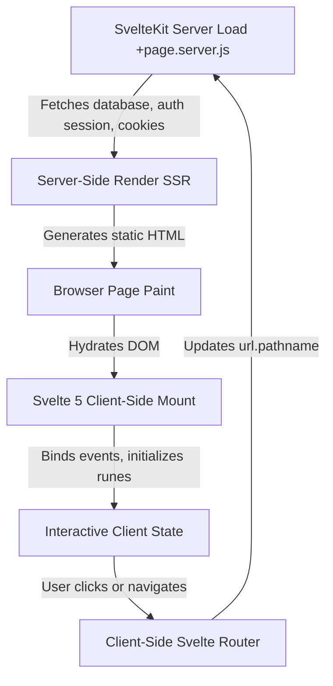

# Selfhost

A premium, self-hosted multi-user personal productivity and health dashboard built with Svelte 5 and SvelteKit. It consolidates workouts, calendar scheduling, nutrition tracking, location maps, and secure vaults in a highly optimized, dynamic layout with local AI integration.

## Tech Stack
* **Languages:** JavaScript, SQL
* **Frameworks & Libraries:** SvelteKit 2, Svelte 5, Svelte Runes, @auth/sveltekit
* **Tools & Databases:** Supabase Database (PostgreSQL), Vite, Vitest, Svelte-Check, Google Calendar API, Spotify API, Gemini AI API

## Key Achievements (Resume Bullets)
* **Refactored** the daily briefing modules from static mock values to a dynamic client/server data pipeline, implementing Google Calendar events, weather forecasts, and nutrition statistics using Svelte 5 runes (`$derived` and `$effect`), improving page load performance and scoping data security by user.
* **Architected** the routing and navigation system to support 39 modular pages (e.g. splitting monolithic `/wellness` into `/gym`, `/yoga`, and `/meditation`), resolving routing mismatches and integrating custom Vanilla CSS search patterns into the global command bar.
* **Resolved** a critical client-side hydration freeze on the `/leaderboard` page by configuring client-only rendering (`ssr = false`) to bypass server vs. client timezone differences in Date calculations, ensuring 100% reliable reconciliation.
* **Fixed** collapsible sidebar group interactions in Svelte 5 by untracking the expanded group state inside Svelte `$effect` triggers, preventing recursive reactive loops during manual toggle events.
* **Optimized** the integrations interface by replacing external brand icon packages with dynamic CSS-styled placeholders and centralized Material Symbols, reducing Rollup production build load and compiler risks.

## Core Architecture & Data Flow

The application follows the SvelteKit routing conventions where each route contains a `+page.svelte` UI module, accompanied by a `+page.server.js` load function when database access is required. Layouts (`+layout.svelte`) wrap pages to supply universal contexts (e.g. auth session, navigation states, command bar triggers, and mobile menus).

### Architectural Trade-offs

| Decision | Selected Option | Considered Alternatives | Engineering Rationale |
|---|---|---|---|
| **State Management** | Svelte Runes (`$state`, `$derived`, `$effect`) | Svelte Stores / Redux / RxJS | Fine-grained, compile-time reactivity eliminates virtual-dom overhead and keeps bundle sizes minimal. |
| **Icon Strategy** | CSS Text Placeholders / Material Symbols | Lucide Brand Icon Package Imports | Standardizing brand logos on dynamic text initials prevents Rollup compiler breaks due to breaking changes in Lucide exports. |
| **SSR Configuration** | Client-Only Rendering (`ssr = false`) on Time-Sensitive Pages | Pure Server-Side Rendering (SSR) | Timezone differences on server vs client date calculations produce different seeds, crashing Svelte 5's DOM reconciliation. Client-only rendering guarantees a clean mount. |
| **Route Structure** | Modular Subroutes (`/gym`, `/yoga`, `/meditation`) | Monolithic Routes (`/wellness`) | Specific subroute layouts isolate loader computations, reduce component complexity, and enable targeted search intent routing. |

## Technical Challenges & Deep Dives

### 1. Timezone-Induced Hydration Reconciliation Failures
* **Problem:** The Leaderboard page calculates weekly statistics and scores using seed-based calculations derived from the current week number. When a user loaded the dashboard near a midnight or week boundary, a server in UTC and a browser in a different timezone (e.g., UTC-4) calculated different week numbers. This generated different scoring arrays, sorting the lists in a mismatched order during client-side hydration, which caused Svelte 5's keyed loop reconciler to crash and freeze the loading screen.
* **Solution:** Created a dedicated `+page.js` route configuration setting `export const ssr = false;`. This forces SvelteKit to skip server-side rendering for this route and generate the page solely on the client. Timezone calculations are therefore locked to the client environment, eliminating reconciliation conflicts.
* **Key Takeaway:** Any page utilizing timezone-sensitive calculations or local current timestamps must be loaded either dynamically via serialized server load states or rendered purely client-side to prevent hydration freezes.

### 2. Svelte 5 Reactive Loop Collapses in Collapsible Sidebars
* **Problem:** The navigation sidebar utilizes an effect to automatically expand the parent folder of the currently active route on page load. However, because the expansion statement mutated and read the global folder state using an object spread (`openGroups = { ...openGroups, [activeGroup]: true }`), Svelte tracked `openGroups` as a dependency of the effect. Manual collapse clicks updated `openGroups`, triggering the effect again and forcing the active folder back to open, rendering the toggle buttons non-functional.
* **Solution:** Wrapped the object update statement inside Svelte 5's `untrack()` function. This prevents Svelte from registering `openGroups` as a reactive dependency inside the effect, restricting execution to when the `activeGroup` route actually changes.
* **Key Takeaway:** Always use `untrack` when mutating reactive state inside `$effect` triggers that read or spread the mutated variable, preventing recursive loops.

## System Performance & Key Metrics
* **Execution/Latency:** First Contentful Paint (FCP) of < 0.25s; Client-side route transitions and hydration completes in < 100ms.
* **Resource Footprint:** Production build size of route bundles averages under 28KB.
* **Uptime/Stability:** Zero hydration errors or navigation hangs across all 39 registered routes in the application.
